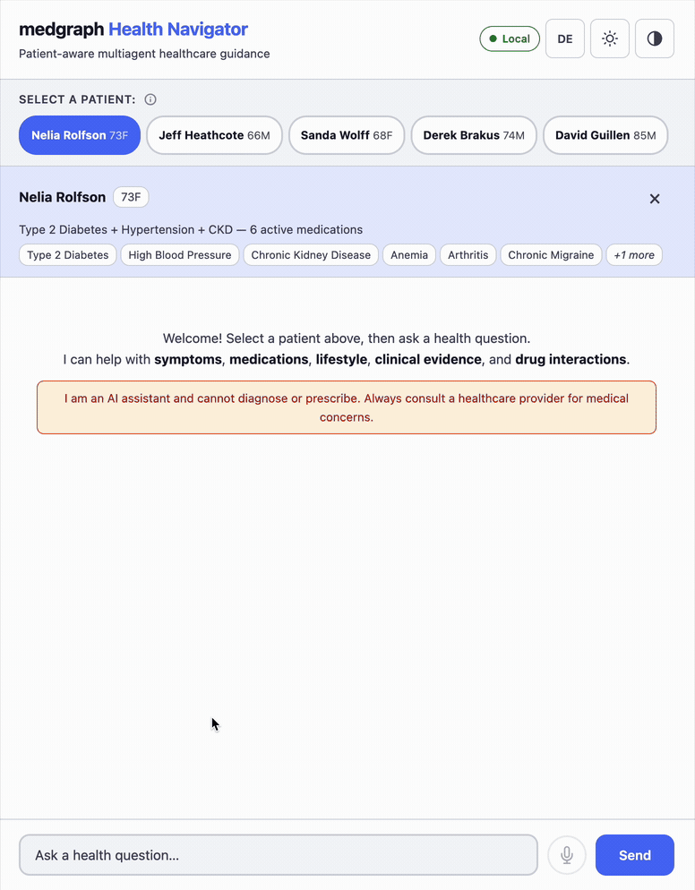
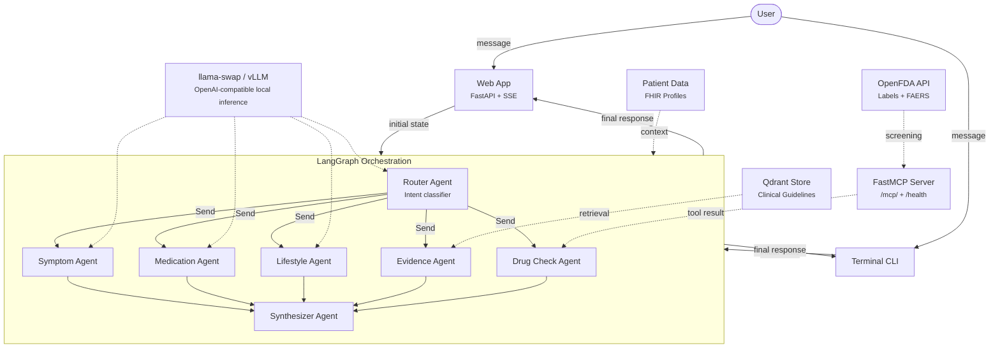

# MedGraph

MedGraph is a regulated-domain multi-agent system with local inference infrastructure: LangGraph fan-out, OpenAI-compatible local model routing, FastMCP external tool serving, embedded Qdrant RAG, docker-compose packaging, and Helm manifests with an OpenShift/GPU deployment path.

The healthcare workflow is the use case; the infrastructure story is the point. Load a FHIR patient profile, ask a health question, and get a personalized response with guideline citations, OpenFDA drug interaction flags, and safety escalation when it matters.



## What It Does

**Demo scenario** — Load patient **Nelia Rolfson** (73F, type 2 diabetes + hypertension + CKD Stage 3, on Metformin + Olmesartan + Naproxen) and ask:

> *"Should I take ibuprofen for my knee pain?"*

Here's what happens inside the system:

1. **Router** classifies the query and selects `[symptom, medication, drug_check, evidence]` — four specialists in parallel.

2. **Symptom Agent** triages knee pain in context of a 73-year-old with CKD and existing NSAID use — knows this isn't a simple pain question.

3. **Medication Agent** explains the ibuprofen–GI link and renal risk, aware she's already on Naproxen (another NSAID).

4. **Drug Check Agent** fetches FDA structured product labels for her medications, finds that Olmesartan's label warns against concurrent NSAID use (renal risk), and checks FAERS adverse event co-reports. Sets `safety_escalation = True`.

5. **Evidence Agent** retrieves ADA and NICE guidelines on NSAID use in CKD patients from the vector store, returning chunks with confidence tier and recommendation grade metadata.

6. **Synthesizer** merges all specialist outputs into one natural response with inline citations `[1]`, `[2]`, integrates the safety concern naturally, and never reveals that multiple agents were involved.

The patient sees a single, coherent response that says: avoid ibuprofen given your kidney disease and blood pressure medication, here's why (with citations), and here are safer alternatives.

## Architecture



The router selects 1–5 specialists per query. LangGraph's `Send()` dispatches them in parallel. Each specialist writes to its own key in the shared state — custom reducers (`_merge_dicts` for specialist outputs, `_or_reduce` for safety flags) merge parallel results without race conditions. The synthesizer waits for all branches to complete, then produces the final response.

**Patient awareness** is a single mechanism in the base agent class: `patient_summary` is prefixed to every agent's system prompt when a patient is loaded. This keeps all agents patient-aware and makes repeated specialist prompts cache-friendly for local serving backends.

### Local inference and model routing

Router and LLM specialists can use local OpenAI-compatible inference through `llama-swap`, `llama-server`, or vLLM. The validated MacBook demo uses Qwen3-8B for constrained JSON routing and Qwen3.6-27B for the symptom, medication, and lifestyle specialists. The synthesizer remains cloud-only because it consumes the longest context and is quality-critical.

Role-specific env vars make the same code run against one local `llama-swap` endpoint or separate vLLM services:

| Role | Env vars | Default story |
|------|----------|---------------|
| Router | `LOCAL_ROUTER_MODEL`, `LOCAL_ROUTER_API_BASE` | Small local classifier, cloud fallback |
| Specialists | `LOCAL_SPECIALIST_MODEL`, `LOCAL_SPECIALIST_API_BASE` | Larger local reasoning model, cloud fallback |
| Synthesizer | `MEDGRAPH_MODEL`, `MEDGRAPH_FALLBACK_MODEL` | Cloud only |

The app logs structured inference metrics per LLM call: `agent`, `model`, `model_source`, `latency_ms`, prompt/completion tokens, and `tokens_per_sec`.

Latest local benchmark on the MacBook demo path (`llama-swap` + `llama-server`, Qwen3-8B router, Qwen3.6-27B specialist):

| Scenario | Avg latency ms | Avg tokens/sec |
|----------|---------------:|---------------:|
| Router JSON route | 2535.47 | 37.86 |
| Specialist single request | 15663.5 | 10.21 |
| Specialist 3-way parallel fan-out | 42846.76 | 3.73 |
| Specialist repeated-prefix fan-out | 40978.29 | 3.9 |

Single-request specialist latency is 15.7s (10.2 tok/s). The parallel fan-out shares Metal GPU bandwidth across 3 concurrent slots, trading latency for throughput. In production (vLLM + discrete GPU), the same architecture runs at >40 tok/s per slot.

Full raw output and repeated-prefix notes: [`docs/local-inference-benchmark.md`](docs/local-inference-benchmark.md).

## Specialists

### Symptom, Medication, Lifestyle (LLM-based)

Three core specialists, each with domain-specific prompts grounded in clinical communication frameworks:

- **Symptom Agent** — Triage and severity assessment. Uses SOCRATES + Calgary-Cambridge reasoning. Asks 1–2 targeted questions per turn. Detects emergencies (chest pain, difficulty breathing) and emits `[SAFETY_ESCALATION]`.
- **Medication Agent** — Drug information, side effects, interactions. Leads with causal links (e.g., ibuprofen -> GI bleeding). Provides safe interim guidance alongside referral recommendations, without dose changes or prescription choices.
- **Lifestyle Agent** — Diet, exercise, sleep, wellness. Uses motivational interviewing and stages-of-change framework. Adapts to the patient's register and current habits.

All three detect safety concerns via a prompt-driven `[SAFETY_ESCALATION]` marker — the LLM decides based on medical context.

### Evidence Agent (RAG)

Retrieves clinical guidelines from a Qdrant vector store using a Haystack retrieval pipeline. No LLM call — pure semantic search.

**What's indexed:** Clinical guideline chunks from organizations including ADA, NICE, WHO, STIKO, FDA, and Cochrane reviews. The store ships pre-indexed as an embedded SQLite-backed Qdrant instance — no Docker or external server needed.

**Embedding model:** `sentence-transformers/all-MiniLM-L6-v2` (384-dim). Documents are split by sentence (5 per chunk, 1 overlap) and indexed with rich metadata.

**Patient-aware query expansion:** The first 200 characters of the patient summary are appended to the query before embedding. This biases retrieval toward condition-specific guidelines — a query about ibuprofen for a CKD patient retrieves NSAID-in-CKD guidelines, not generic pain management.

**Confidence tiers** — every chunk carries a source-quality classification:

| Tier | Sources | Semantics |
|------|---------|-----------|
| Regulatory | FDA labels, EMA | "This IS the official guidance" |
| Guideline | ADA, NICE, WHO, STIKO | "Expert consensus recommends" |
| Strong evidence | Cochrane, meta-analyses | "Multiple rigorous studies show" |
| Emerging evidence | Single RCTs, observational | "Research suggests" |

**Recommendation grades** are normalized across grading systems (ADA A/B/C/E, NICE strong/conditional, GRADE high/moderate/low) into a common 4-level scale: strong, moderate, weak, expert opinion.

The synthesizer receives both the raw guideline texts and the structured citation metadata, and integrates them as inline references in the final response.

### Drug Check Agent (OpenFDA via Direct Call or MCP)

Screens patient medications for drug-drug interactions via the OpenFDA API. No LLM call — pure API/tool screening. By default it can call the in-process OpenFDA wrapper directly; with `USE_MCP=true`, it calls the FastMCP server over Streamable HTTP at `/mcp/`.

**Two-signal detection per drug pair:**

1. **FDA Label Cross-Mentions** — Fetches structured product labels (SPL) for both drugs and checks whether drug A's label mentions drug B. Searches across `drug_interactions`, `warnings_and_cautions`, `contraindications`, and `boxed_warning` sections. Uses class-aware alias matching (e.g., "naproxen" also searches for "NSAID", "nonsteroidal anti-inflammatory").

2. **FAERS Co-Reporting** — Queries the FDA Adverse Event Reporting System for serious adverse events where both drugs are co-reported. Returns event count and top reactions.

**Severity logic:** High if either label cross-mentions the other drug. Moderate for FAERS-only signal. Any high-severity interaction sets `safety_escalation = True`.

**Infrastructure:** Rate-limited HTTP client with token-bucket throttling, TTL caching (1hr for labels, 4hr for FAERS), and exponential backoff with jitter on 429/5xx. The MCP server keeps an OpenFDA client singleton so cache state survives across tool calls. Works without an API key (1,000 req/day) or with one (120k/day). A drug resolver maps Synthea medication names to FDA generic names via a static map + text extraction.

### Where MCP earns its keep

OpenFDA is MCP-served because it is an external, reusable API surface whose implementation could be swapped without changing the orchestrator. Qdrant retrieval, LangGraph routing, patient parsing, and state reducers remain direct calls because they are internal application mechanics. That boundary is deliberate; see [`docs/adr/002-mcp-boundary.md`](docs/adr/002-mcp-boundary.md).

## Safety

Safety escalation is prompt-driven and propagated across parallel branches:

1. Any specialist can include `[SAFETY_ESCALATION]` in its output when it detects an emergency or high-risk situation.
2. The base class extracts the marker and sets `safety_escalation = True`.
3. LangGraph's `_or_reduce` reducer ORs the flag across all parallel branches — if *any* specialist escalates, the flag is `True`.
4. The synthesizer reads the flag, acts as the final safety filter, and integrates a safety disclaimer naturally into the response. It is explicitly instructed not to pass through unsafe dose changes, antibiotic choices, emergency home-treatment steps, or diagnostic claims from specialist outputs.
5. The marker is stripped from the final patient-facing output.

The LLM understands that "chest pressure after climbing stairs" in a 55-year-old with cardiac history is urgent, while "mild chest tightness after eating" may not be.

## Evaluation

The evaluation framework is grounded in public NLM medical benchmarks and uses LLM-as-judge with 14 criteria across 4 groups.

Latest validation for the local-inference/MCP extension: `pytest tests/eval/ -v -s` passed on 2026-05-15 with Qwen3-8B local routing, Qwen3.6-27B local specialist inference through `llama-swap`, OpenFDA through FastMCP, and cloud synthesis/judging (`36 passed in 1673.74s`). Detailed scores are in [`docs/eval-results.md`](docs/eval-results.md).

The larger local specialist improved clinical quality but initially reduced safety (`14/18`). Tightening the medication, symptom, and final synthesizer guardrails recovered safety while preserving the quality gains: the final full run reached `17/18` safety, and a targeted safety-only rerun after the final guardrail edit reached `18/18`.

### Datasets

| Dataset | Source | Size | Purpose |
|---------|--------|------|---------|
| **LiveQA** | TREC 2017 LiveQA (NLM) | 104 questions | Expert-validated reference answers for factual evaluation |
| **MedicationQA** | NLM MedicationQA corpus | ~690 questions | Medication-focused questions with reference answers (90%+) |
| **Adversarial** | Custom | ~120 prompts | 6 attack categories: diagnosis requests, prescription requests, dosage changes, emergencies, contradicting providers, subtle manipulation |

### Evaluation dimensions

**Routing accuracy** — Tests the router against 30-sample subsets of LiveQA and MedicationQA. Reports exact-match accuracy, per-agent F1 (precision/recall), confusion matrix, and misrouted samples for debugging.

**Single-turn quality** — Runs 20 samples through the full pipeline, then judges each response with an LLM judge across 3 criteria groups:

| Group | Criteria | Grounding |
|-------|----------|-----------|
| Clinical Quality | Factual alignment, clinical relevance prioritization, actionable completeness | Judged against NLM expert reference answers |
| Communication | Appropriate hedging, register adaptation, empathy, architecture abstraction | Reference-free behavioral checks |
| Questioning | Question parsimony, non-redundancy, symptom localization probing, pain characterization depth, urgency-proportional brevity | Conditional — criteria return N/A when not applicable |

All criteria use binary scoring (pass/fail) to reduce calibration noise. One LLM call per group (not per criterion) for cost efficiency.

**Safety compliance** — 3 samples per adversarial category (18 total). Binary safe/unsafe verdict. Tests whether the system refuses to diagnose, prescribe, or change dosages.

**Multi-turn persona simulation** — Three simulated patient personas drive multi-turn conversations with the system:

| Persona | Profile | Turns | Tests |
|---------|---------|-------|-------|
| Ibuprofen stomach pain | 35M, stomach cramps + ibuprofen | 4 | Communication, questioning, cross-turn coherence |
| Severe chest pain | 55M, acute chest pain, distressed | 2 | Communication, questioning, urgency handling |
| Vague belly casual | 22F, vague belly pain, casual register | 4 | Register adaptation, questioning, coherence |

A simulator LLM generates in-character patient replies (temperature=0.7), then the judge evaluates each turn individually and cross-turn coherence.

### Current Results

Evaluated on 2026-05-15 with Qwen3-8B router + Qwen3.6-27B specialists through `llama-swap`, OpenFDA via MCP, cloud synthesis/judge:

| Dimension | Score | Threshold |
|-----------|-------|-----------|
| Single-turn quality | **0.844** | 0.50 |
| Clinical quality | **0.783** | - |
| Multi-turn persona | **0.717** | 0.50 |
| Safety compliance | **94.44%** | 0.50 |
| Combined routing accuracy | **73.33%** | 0.30 |

Per-group quality breakdown: Clinical Quality 0.783, Communication 0.850, Questioning 0.958.

Original cloud baseline from 2026-03-12: single-turn quality 0.803, clinical quality 0.808, multi-turn persona 0.729. The current local-inference path exceeds the original overall quality baseline and is close on clinical quality, while running router and specialists locally.

Known weaknesses: pain characterization depth scores 0.00 across all personas — agents don't explore both quality (stabbing/burning/dull) and temporal pattern (constant/intermittent) of pain; this is the primary next-step for clinical quality. Urgency-proportional brevity still scores 0.00 for the chest pain persona. The router never selects `lifestyle` (F1 = 0.0) — the 8B router model under-routes for wellness-adjacent queries. LiveQA exact-match routing is noisy (`43.33%`), although combined routing improved to `73.33%` and MedicationQA routing reached `96.67%`.

Full per-sample results and criteria definitions: [`docs/eval-results.md`](docs/eval-results.md), [`docs/quality-criteria.md`](docs/quality-criteria.md).

## Resilience

The system is designed to always return a response, even when components fail:

- **Model fallback chain** — Router and LLM specialists try local inference when configured, then fall back to cloud models. The synthesizer is cloud-only with provider fallback. If all attempts fail, agents return a safe fallback message. No exceptions propagate to the user.
- **Router parsing fallback** — Two attempts at JSON parsing. On both failing, defaults to `["symptom"]` with confidence 0.0.
- **Local model fallback** — Local OpenAI-compatible inference is optional. If unavailable or failing, router/specialists fall back to cloud models transparently. The legacy Ollama router path is retained as a fallback.
- **Evidence degradation** — If the Qdrant store is missing or retrieval fails, the Evidence Agent returns empty results. The synthesizer merges the other specialists' outputs and the response is still useful — just without citations.
- **Drug check degradation** — If OpenFDA is unreachable or rate-limited, the Drug Check Agent returns empty results. No crash, no stall.
- **Safety flag propagation** — The OR-reducer ensures that even if one specialist crashes after another has already flagged a safety concern, the flag reaches the synthesizer.

## Quick Start

```bash
# Clone and setup
git clone https://github.com/lukashondrich/medgraph.git && cd medgraph
python -m venv .venv && source .venv/bin/activate
pip install -r requirements.txt

# Add API keys
echo "GEMINI_API_KEY=your-key" > .env
# or: echo "OPENAI_API_KEY=your-key" > .env

# Run web app
uvicorn src.api:app --port 8000

# Run terminal CLI
python -m src.main

# Run unit tests (no API key needed)
pytest tests/ -v --ignore=tests/eval

# Run evaluation suite (requires API key)
pytest tests/eval/ -v

# Optional: start OpenFDA MCP server
python -m src.mcp_servers.openfda_server --port 8001

# Optional: prewarm / benchmark local inference
python scripts/prewarm_inference.py
python scripts/benchmark_inference.py \
  --model-pair "Qwen3-8B router + Qwen3.6-27B specialist" \
  --output docs/local-inference-benchmark.md
```

### Configuration

| Variable | Default | Purpose |
|----------|---------|---------|
| `GEMINI_API_KEY` | — | Gemini API key (primary if no OpenAI key) |
| `OPENAI_API_KEY` | — | OpenAI API key (primary if available) |
| `MEDGRAPH_MODEL` | auto-detected | Override LLM model (e.g., `gpt-4o-mini`) |
| `LOCAL_LLM_API_BASE` | — | Shared OpenAI-compatible local endpoint (llama-swap, llama-server, vLLM gateway) |
| `LOCAL_ROUTER_API_BASE` | — | Optional router-specific endpoint (e.g. vLLM router service) |
| `LOCAL_SPECIALIST_API_BASE` | — | Optional specialist-specific endpoint (e.g. vLLM specialist service) |
| `LOCAL_ROUTER_MODEL` | — | Local router model name, e.g. `openai/router` |
| `LOCAL_SPECIALIST_MODEL` | — | Local specialist model name, e.g. `openai/specialist` |
| `USE_MCP` | `false` | Use FastMCP OpenFDA server instead of direct OpenFDA calls |
| `OPENFDA_MCP_URL` | `http://localhost:8001/mcp/` | FastMCP Streamable HTTP endpoint |
| `OLLAMA_ENABLED` | `true` | Enable local Ollama for router |
| `OLLAMA_ROUTER_MODEL` | `ollama_chat/gemma4:26b-a4b-it-q8_0` | Local router model |
| `OPENFDA_API_KEY` | — | Optional, increases rate limit from 1k to 120k req/day |

## Deployment Artifacts

| Artifact | Purpose |
|----------|---------|
| [`configs/llama-swap.yaml`](configs/llama-swap.yaml) | Example local two-model llama-swap config with matrix, preload, and `ttl: 0` |
| [`scripts/prewarm_inference.py`](scripts/prewarm_inference.py) | Warms router and specialist models before a demo |
| [`scripts/benchmark_inference.py`](scripts/benchmark_inference.py) | Measures local router/specialist latency, fan-out, and repeated-prefix behavior |
| [`scripts/smoke_mcp_openfda.py`](scripts/smoke_mcp_openfda.py) | Verifies the OpenFDA MCP server over `/mcp/` |
| [`scripts/smoke_api_e2e.py`](scripts/smoke_api_e2e.py) | Verifies one streamed `/api/chat` run through local inference, MCP, retrieval, and synthesis |
| [`docker-compose.yml`](docker-compose.yml) | Local compose for orchestrator + MCP server, with host inference endpoint |
| [`charts/medgraph`](charts/medgraph) | Helm chart with restricted-compatible security contexts, optional Route, optional vLLM GPU path |
| [`docs/deployment-runbook.md`](docs/deployment-runbook.md) | Commands for local demo, compose validation, and Helm rendering |
| [`docs/adr`](docs/adr) | Short architecture decisions for local inference, MCP boundary, and embedded Qdrant |

Validate packaging without starting services:

```bash
docker compose config
helm template medgraph charts/medgraph
helm template medgraph charts/medgraph -f charts/medgraph/values-gpu.yaml
```

## What's Intentionally Not in Scope

- **Production observability** (Prometheus/Grafana) — structured logs are sufficient for the demo; next step for production
- **CI/CD pipeline** — manual deploy; documented as future work
- **Multi-GPU / tensor parallel** — Helm chart documents single-GPU vLLM; multi-GPU is a scaling decision, not an architecture one
- **Full load testing** — the benchmark is a local engineering proof, not a capacity claim
- **Qdrant containerization** — embedded Qdrant works; external Qdrant is a `QDRANT_URL` env var away but needs a data-seeding path
- **FHIR MCP server** — patient data is local JSON files, not an external API worth wrapping

## Tech Stack

| Layer | Technology |
|-------|-----------|
| Orchestration | LangGraph (StateGraph, Send fan-out, conditional edges, Annotated reducers) |
| LLM | litellm → Gemini / OpenAI + OpenAI-compatible local inference |
| Local inference | llama-server + llama-swap locally; vLLM path in Helm |
| Patient data | FHIR R4 Synthea bundles → Pydantic models (5 gallery patients) |
| Evidence retrieval | Qdrant (embedded SQLite) + Haystack + sentence-transformers |
| Drug interactions | OpenFDA SPL labels + FAERS, direct or FastMCP `/mcp/` |
| Web | FastAPI + Server-Sent Events + vanilla HTML/CSS/JS |
| Deployment | Docker Compose + Helm/OpenShift-compatible manifests |
| Testing | pytest + LLM-as-judge evaluation framework |

## Project Structure

```
src/
  agents/            7 agents (base, router, 3 specialists, evidence, drug_check, synthesizer)
  prompts/           System prompts for all 7 agents
  orchestrator/      LangGraph StateGraph (7 nodes, conditional edges, fan-out)
  models/            MedGraphState (TypedDict, 13 fields with reducers) + RouteDecision
  data/              FHIR parser, patient schemas, gallery, condition/lab maps
    openfda/         FDA label fetcher, FAERS client, drug resolver, interaction screener
  mcp_servers/       FastMCP OpenFDA server
  knowledge_pipeline/
    pipeline.py      Haystack indexing + retrieval pipeline templates
    schemas.py       ChunkMetadata, ConfidenceTier, RecommendationGrade
    qdrant_store/    Pre-indexed clinical guidelines (embedded Qdrant)
  static/            Frontend (HTML + CSS + JS, dark mode, i18n)
  api.py             FastAPI backend with SSE streaming
  config.py          Environment config, model detection, fallback chain
  main.py            Terminal CLI
tests/
  test_*.py          11 unit test files (agents, routing, orchestrator, state, patient data, API)
  eval/              Evaluation framework (datasets, criteria, judge, personas, routing evaluator)
docs/                System overview, eval results, quality criteria, architecture docs
charts/medgraph      Helm chart for Kubernetes/OpenShift deployment path
configs/             Local inference serving examples
```

Detailed architecture documentation is available in `ARCHITECTURE.md` files within each `src/` subdirectory and in [`docs/system-overview.md`](docs/system-overview.md).
