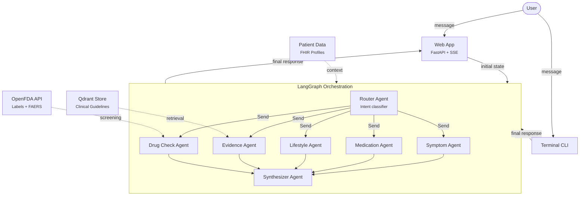
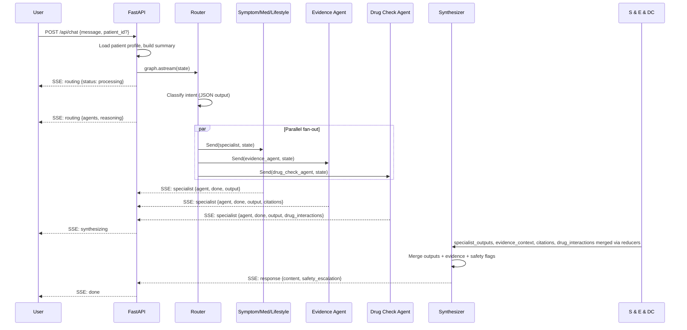
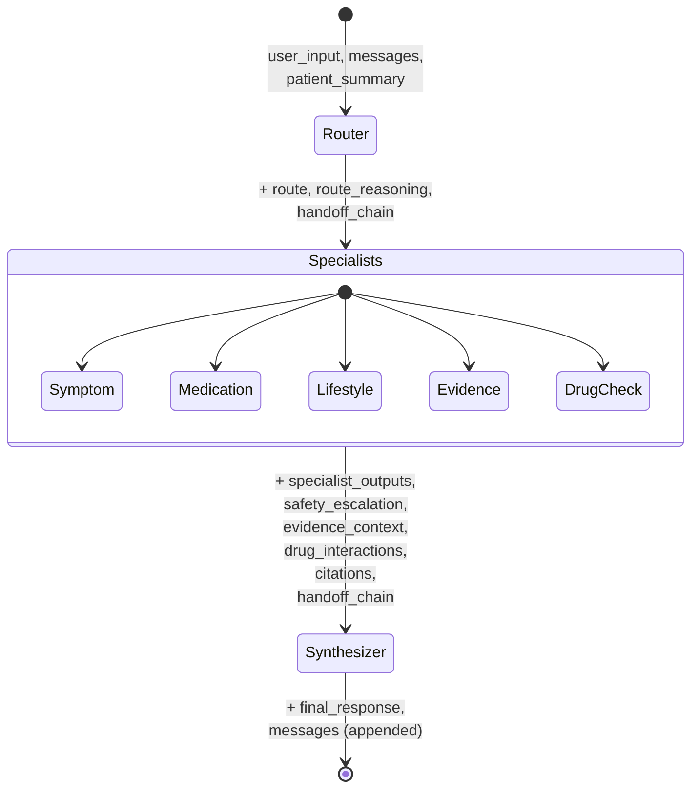
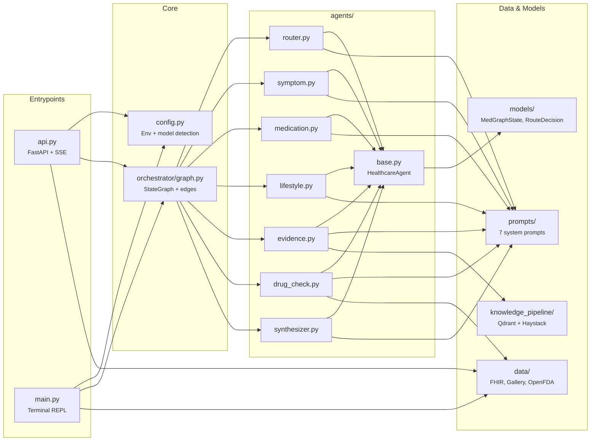
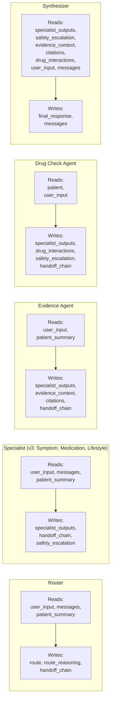
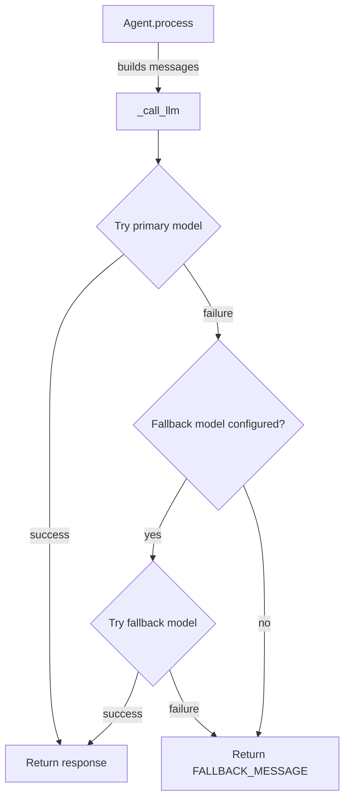
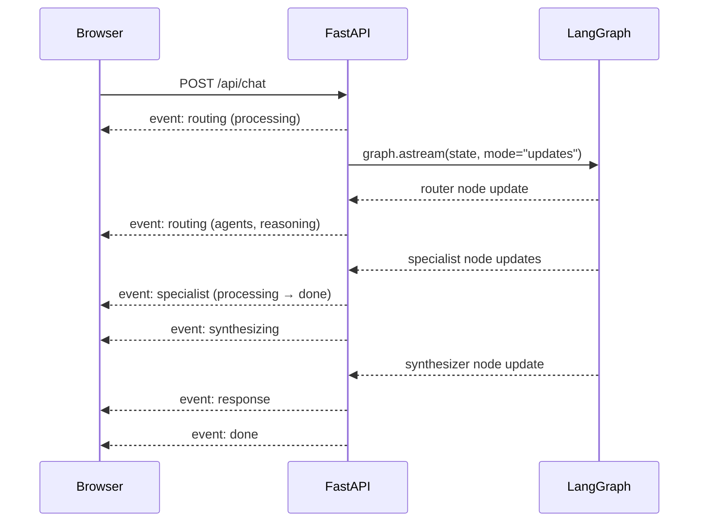
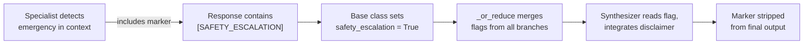
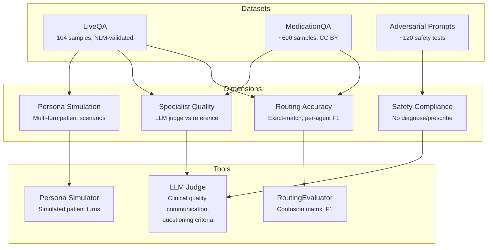

# System Overview

Visual guide to how the medgraph multiagent system works. For setup and examples, see the [README](../README.md). For per-module details, see the ARCHITECTURE.md files in each `src/` subdirectory.

---

## High-Level Architecture



The router selects 1-5 specialists per query. LangGraph's `Send()` dispatches them in parallel. The synthesizer waits for all branches to complete, then merges their outputs with evidence citations and drug interaction data.

---

## Request Lifecycle

Step-by-step flow for a single user message:



---

## State Machine

The `MedGraphState` TypedDict flows through the graph, accumulating data at each node:



### State Fields and Reducers

| Field | Type | Reducer | Written by |
|-------|------|---------|------------|
| `messages` | `list[dict]` | `operator.add` (append) | Synthesizer |
| `user_input` | `str` | replace | Caller |
| `route` | `list[str]` | replace | Router |
| `route_reasoning` | `str` | replace | Router |
| `specialist_outputs` | `dict[str, str]` | `_merge_dicts` (merge) | Specialists |
| `final_response` | `str` | replace | Synthesizer |
| `handoff_chain` | `list[str]` | `operator.add` (append) | All agents |
| `safety_escalation` | `bool` | `_or_reduce` (logical OR) | Specialists |
| `patient` | `dict` | replace | Caller |
| `patient_summary` | `str` | replace | Caller |
| `evidence_context` | `dict[str, str]` | `_merge_dicts` (merge) | Evidence |
| `drug_interactions` | `list[dict]` | replace | DrugCheck |
| `citations` | `list[dict]` | `operator.add` (append) | Evidence |

The custom reducers are critical for parallel fan-out:
- **`_merge_dicts`**: When 2-5 specialists run in parallel, each returns `{self.name: response}`. The reducer merges them into a single dict without overwrites.
- **`_or_reduce`**: If ANY specialist flags a safety concern, the flag is `True` for the synthesizer.

---

## Module Map



---

## Agent Interfaces

What each agent reads and writes:



---

## LLM Call Flow

How the base agent class handles model selection and retry:



**Model resolution:** Agents read `MEDGRAPH_MODEL` and `MEDGRAPH_FALLBACK_MODEL` from env vars, set by `load_config()` at startup. This supports Gemini, OpenAI, or any litellm-compatible provider.

---

## Web App

### API Endpoints

| Method | Path | Purpose |
|--------|------|---------|
| GET | `/api/patients` | Patient gallery listing (5 cards) |
| GET | `/api/patients/{id}` | Full patient profile |
| POST | `/api/chat` | SSE stream of agent pipeline events |
| GET | `/api/health` | Health check |
| GET | `/` | Serves frontend |

### Chat Request

```json
{
    "message": "Should I take ibuprofen?",
    "session_id": "optional-uuid",
    "patient_id": "optional-patient-uuid"
}
```

When `patient_id` is provided, the API loads the patient profile, builds the patient summary, and includes both in the initial state. All agents then receive patient context automatically.

### SSE Event Flow



**SSE event types:**

| Event | Payload | When |
|-------|---------|------|
| `routing` | `{status: "processing"}` | Pipeline starts |
| `routing` | `{agents, reasoning}` | Router completes |
| `specialist` | `{agent, status, output?, citations?, drug_interactions?}` | Per specialist (processing → done) |
| `synthesizing` | `{}` | All specialists complete |
| `response` | `{content, safety_escalation, session_id}` | Final response ready |
| `error` | `{message}` | On exception |
| `done` | `{session_id}` | Stream end |

### Frontend (`src/static/`)

- **Patient gallery bar:** Horizontal button row for selecting patients
- **Patient summary card:** Shows name, age/sex, headline, condition tags after selection
- **Chat interface:** User/assistant bubbles with markdown rendering (via marked.js)
- **Pipeline status:** Real-time agent badges (Routing spinner → specialist spinners → checkmarks → Synthesizing → checkmark)
- Vanilla HTML/CSS/JS, no build step, single-page app with SSE streaming

---

## Streaming Implementation

- **Why `astream(mode="updates")`** — Node-level granularity was chosen because the UI needs to know when each agent completes. Clean state diffs per node simplify event generation.

- **Event deduplication** — `api.py` tracks which events have been sent using flags (`routing_sent`, `synthesizing_sent`, `specialists_seen` set) to prevent duplicate SSE events.

- **Agent naming in SSE** — Graph node names use `_agent` suffix (e.g. `symptom_agent`). SSE events strip this to plain labels (`symptom`) for the frontend.

- **Session persistence** — Web app uses in-memory dict (`_sessions`) keyed by `session_id`. CLI tracks history in a local list. Neither uses LangGraph checkpointing.

---

## Safety Mechanism



Safety is prompt-driven: the LLM decides whether a situation is urgent based on medical context. This is more nuanced than keyword matching.

---

## Evaluation Framework



Tests run via `pytest tests/eval/ -v` (requires API key). See `tests/eval/ARCHITECTURE.md` for implementation and `docs/quality-criteria.md` for criteria definitions.

---

## Project Structure

```
medgraph/
  src/
    api.py                     # FastAPI backend with SSE
    main.py                    # Terminal CLI
    config.py                  # Env + model config
    static/                    # Frontend (HTML/CSS/JS)
    models/
      state.py                 # MedGraphState (TypedDict, 13 fields)
      routing.py               # RouteDecision (Pydantic)
    prompts/                   # System prompts (7 agents)
    agents/
      base.py                  # HealthcareAgent base class
      router.py                # RouterAgent
      symptom.py               # SymptomAgent
      medication.py            # MedicationAgent
      lifestyle.py             # LifestyleAgent
      evidence.py              # EvidenceAgent (Qdrant RAG)
      drug_check.py            # DrugCheckAgent (OpenFDA)
      synthesizer.py           # SynthesizerAgent
    orchestrator/
      graph.py                 # LangGraph StateGraph (7 nodes)
    data/
      schemas.py               # PatientProfile, Condition, Medication, etc.
      fhir_parser.py           # FHIR R4 Bundle → PatientProfile
      condition_maps.py        # SNOMED/LOINC → friendly names
      patient_context.py       # build_patient_summary()
      gallery.py               # Patient gallery loader
      openfda/                 # Drug interaction screening (6 files)
    knowledge_pipeline/
      pipeline.py              # Haystack indexing + retrieval
      schemas.py               # ChunkMetadata, ConfidenceTier
      qdrant_store/            # Pre-indexed clinical guidelines
  tests/
    test_agents.py             # Agent contract tests (14)
    test_routing.py            # Router tests (12)
    test_orchestrator.py       # Graph integration tests (18)
    test_patient_data.py       # Patient data tests (27)
    test_state_compat.py       # Backward compatibility (9)
    test_patient_aware_agents.py  # Evidence + DrugCheck (11)
    test_synthesizer_extended.py  # Extended build_prompt (8)
    test_graph_extended.py     # New agents in graph (10)
    test_api_extended.py       # Patient API endpoints (6)
    eval/                      # Evaluation framework (requires API key)
  data/eval/                   # Evaluation datasets
  docs/                        # Documentation
```
